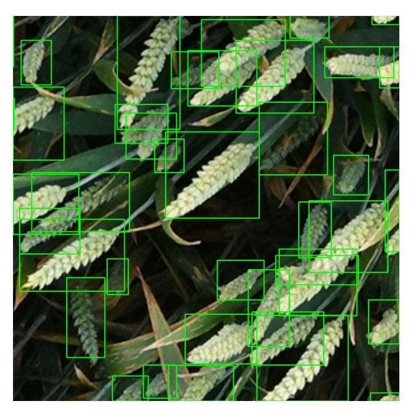

# Global-Wheat-Detection Challenge

Solution for Kaggle's Global Wheat Detection Challenge that got Rank 41 out of 2245 Participants (Top 2% silver Medal).

[Competition Link](https://www.kaggle.com/c/global-wheat-detection)
 
[Leaderboard Link](https://www.kaggle.com/c/global-wheat-detection/leaderboard) 

## Approach
Our solution was to train [EfficientDet Architecture](https://github.com/rwightman/efficientdet-pytorch) with 20% Validation data.We used image size of 1024 as it gave better results than 512 size images.At the time of inference and we used Test Time Augmentation and ensemble using weighted boxes fusion which increased our IOU score.Finally the IOU score was further improved by using psuedo labelling technique on the test data.

## Training Details

* The training can be done with Google Colab's Tesla P100-PCIE-16GB GPU and using [NVIDIA apex](https://github.com/NVIDIA/apex) mixed precision training.
* Some irregular sized bounding boxes were remove which allowed gave us stable training on the Dataset.
* Training on 1024 size images done with batch size of 2 along with ReduceLROnPlateau scheduler.
* Heavy Data Augmentation was done to increase training data.Augmentation techniques include Random Flips, Random Brightness, Random Cutouts and Random Sized crops. We also used   CutMix Mosaic Augmentation for better results.Images using Augmentation are shown.

  
   
   

